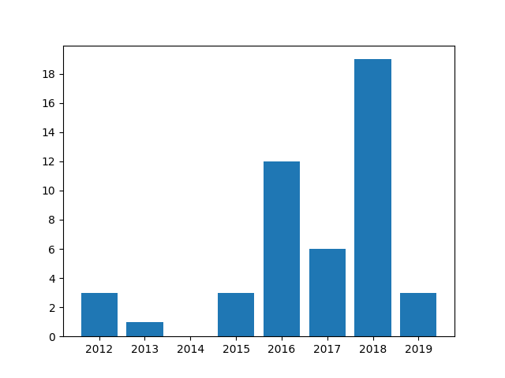

# Python Crawler with RE

## 程式目的與說明
1. 將arXiv的特定作者相關資訊抓取出來
2. 發表年份使用originally announced欄位
3. 若作者不在Author:欄位，則不列入計算
    * 出現的是作者的其他名字，譬如說Ian Goodfellow與Ian J. Goodfellow雖然是同一個人，但是在這裡算不同人
    * 作者出現在et al. (88 additional authors not shown)裡面也不列入計算

## 輸出
1. 將納入計算的result的title印出
2. 將co-author列出，包括作者自己
3. 將每一個年份的發表數列用bar chart畫出
    * 顯示方式
    ```
    $ eog bar_chart.png
    ```


## 其他程式說明
1. [\s\S]\*?\</p>的\*?  
意思是任意長度的最短匹配(non-greedy)  
2. str.split(' ',2)  
意思是以空格為區隔方式，區隔2次(變成3個)，預設為空白符(包含\n等)及最大分割數  
3. str.strip('0')  
把頭尾的很多0去掉，預設為空白符  
4. title=r.split("title is-5 mathjax\">")[1].split("\</p>")[0].strip()  
為取一個區間的辦法，然後再去掉頭尾空格  

## 畫圖套件
1. 安裝畫圖用的matplotlib.pyplot
```
$ sudo pip install --upgrade pip
$ sudo pip install matplotlib
$ sudo apt install python3-tk
```
2. 畫圖方式
```python
import matplotlib.pyplot as plt
x=[1,2,3]
y=[1,2,3]
#設定y軸刻度為1，範圍為0~3
plt.yticks(range(0,3+1,1))
plt.bar(x,y)
plt.show()
```
參考資料  
[No module named _tkinter](https://blog.csdn.net/blueheart20/article/details/78763208)  
[Changing the “tick frequency” on x or y axis in matplotlib?](https://stackoverflow.com/questions/12608788/changing-the-tick-frequency-on-x-or-y-axis-in-matplotlib)  
